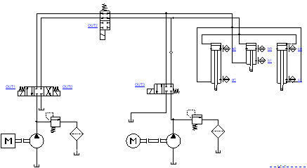
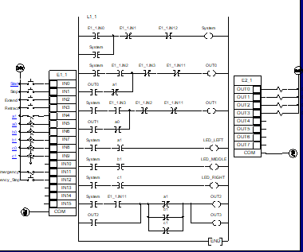
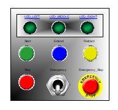
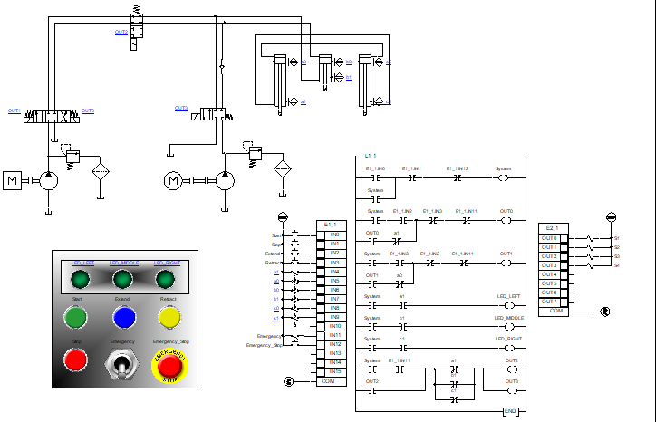

# Hydraulic-Plane-Landing-Gear-Control-System
## Abstract
This project presents the design and simulation of a Hydraulic Plane Landing Gear Control System that incorporates a main pump for regular operations and an emergency pump with a cutoff valve for backup in critical scenarios. The system was modeled and tested in Automation Studio, using a PLC to control hydraulic operations and an HMI for real-time monitoring and manual control. The dual-pump design enhances the reliability and safety of the landing gear system, crucial for aviation applications.

## Introduction
Aircraft landing gear systems are essential for safe takeoff and landing. Hydraulic systems are commonly used due to their ability to generate significant force in a compact design. However, in case of main pump failure, an emergency mechanism is crucial to ensure continued operation.
This project focuses on designing a hydraulic landing gear system that features:
- A main pump for regular operation.
- An emergency pump activated via a cutoff valve when the main pump fails.
The system is controlled by a PLC and monitored through an HMI, ensuring safe and efficient operation.

## Objectives
1. Design a hydraulic system with a dual-pump configuration for enhanced safety.
2. Implement PLC logic for seamless transition between the main and emergency pumps.
3. Develop an HMI for real-time monitoring and manual control.
4. Simulate the system to validate its performance under normal and emergency conditions.

## System Overview
### Hydraulic System Design:
The hydraulic system includes the following components:
- Main Pump: Handles normal operations of the landing gear.
- Emergency Pump: Activated when the main pump fails.
- Cutoff Valve: Switches between the main and emergency pumps.
- Hydraulic Cylinders: Actuate the landing gear retraction and extension.
- Reservoir: Stores hydraulic fluid.
- Directional Control Valves: Manage the flow of hydraulic fluid.

### PLC Control
The PLC program includes:
1. Normal Mode:
   - Operates the main pump and controls the hydraulic cylinders.
   - Monitors gear position sensors.
2. Emergency Mode:
   - Activates via a toggle switch when an failure occurs with the normal mode.

### HMI Design
The HMI interface displays:
- Landing Gear Status: Extended, retracted, or in transition.
- Start, Stop, Extend and Retract Push Buttons.
- Emergency Stop.
- Emergency Landing Gear Switch.

## Schematic and System Design

